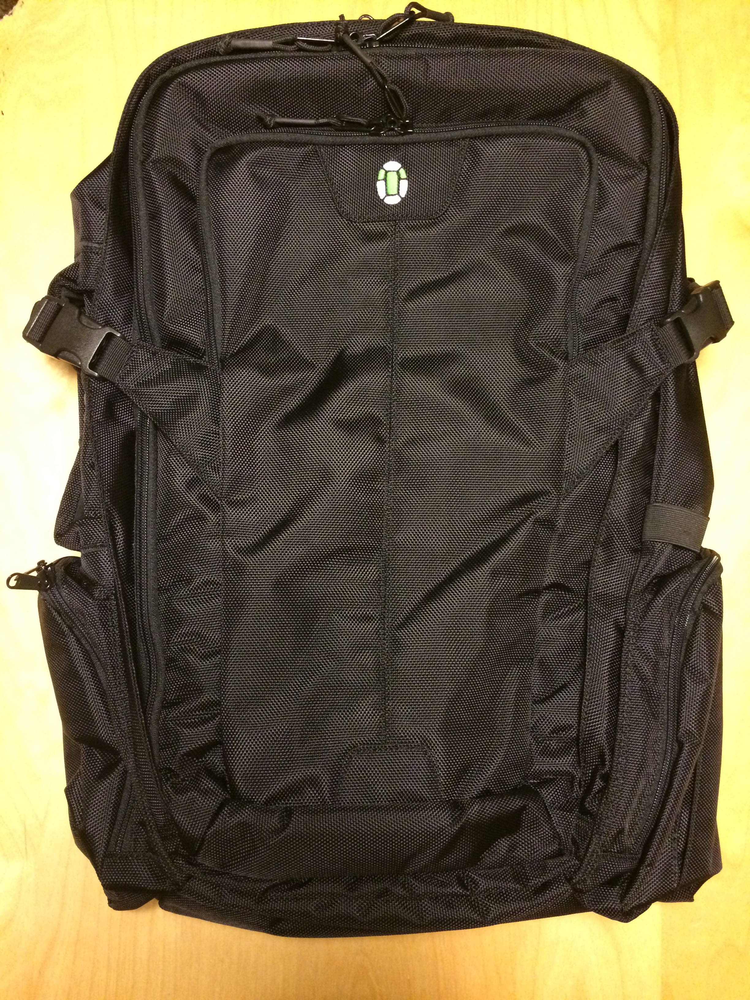
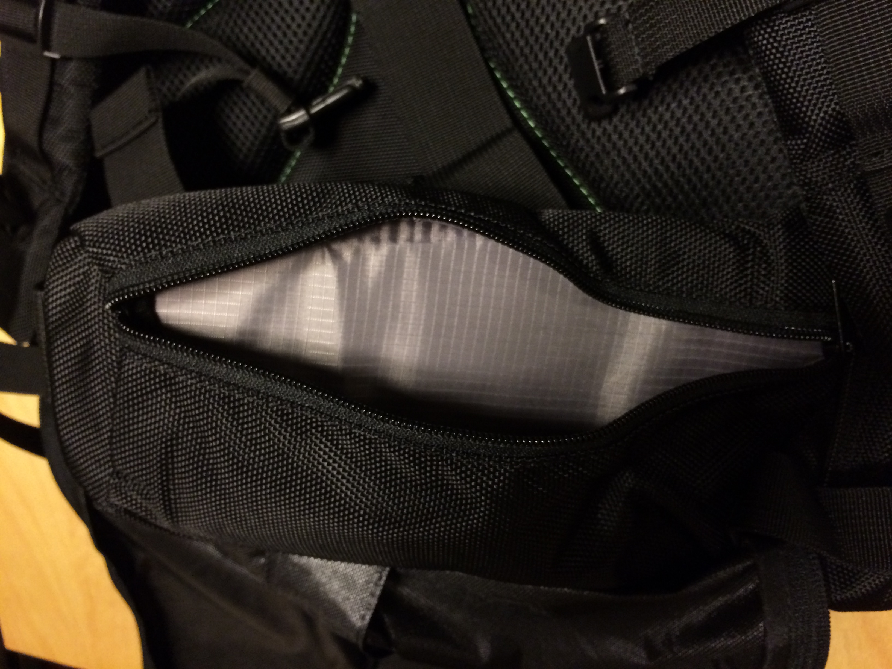
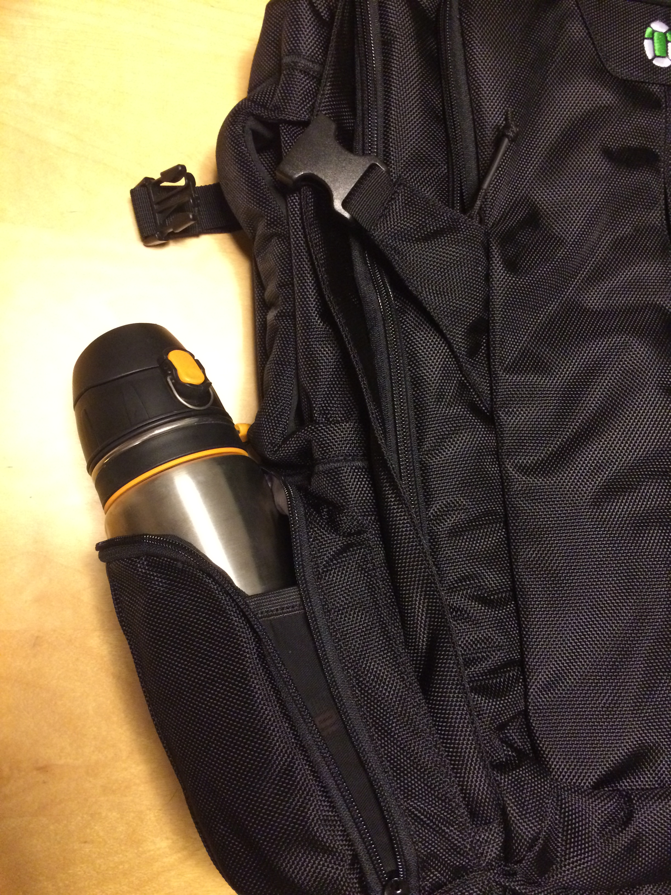
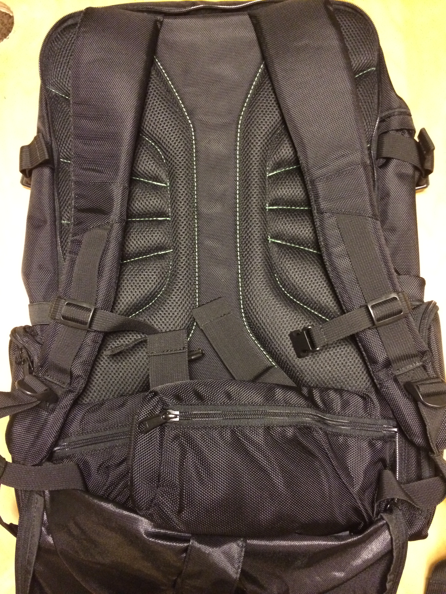
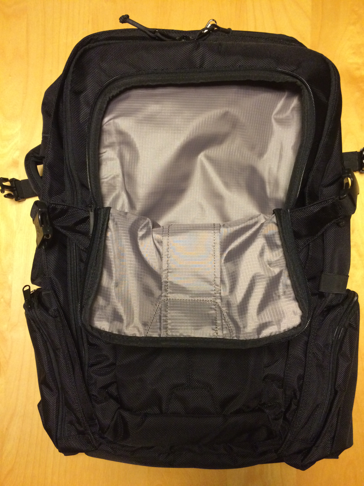

I bought this backpack intending to use it on a one month trip to Southeast Asia.

It has a clean, simple, square look; feels durable enough you could drag it behind a motorcycle; and is quite large.

Key components:

* Large panel-loading main compartment
* Easy Laptop access
* Front pocket
* Side pockets and Hip belt with dual pockets

## Main Compartment

The main compartment is easy to get to, with a large zip-away panel.
You can pack your clothes in two piles then use compression straps with integrated pockets to hold them down.

The top panel of the main compartment has two mesh pockets.

Very happy with the organization options of the main compartment. Easy access, good number of pockets, lockable zipper. No complaints here.

## Laptop Access

The laptop compartment is really nice because it stops above the bottom of the bag. This means when you set the bag down your laptop is far away from bumping the floor, even if it's set down hard. The sleeve shares space with the main compartment, but there is a separate access zipper for it so you can pull it out for airport security. This zipper is lockable.

I thought this was very clever and it seems to work well. Curious if it would work with a very stuffed back, but the laptop sleeve lining is pretty smooth so I think it'd slide right out. Here is my laptop in the bag. For reference, it's a Macbook Air 13". There is tons of room, I think a 17" would fit snugly.

## Side & Hip Pockets

I really like these. The hip pockets are small and would be great for stashing stuff while you're on the move. Here's a close up:

The side pockets are small but mesh sides let them stretch out large enough to fit a big water bottle.

## Backpack / Straps

The backpack straps hide away behind a zipper neatly. It's easy to do and seems really nice. The straps feel comfy.

## Front Pocket

There's an easy-to-access pocket on the front. Here it is:

But this is the bag's achilles heel. The easy-to-get-to, large, document-shaped front pocket has absolutely no organization of any kind. No pockets, no clips, no mesh panels.

It's just a giant cavern of doom for you to throw small things into from whence they shall never return. Look at this picture. Isn't it scary?

 

Makes me so sad. A couple document pockets, passport and phone pocket, and a few clips would be so easy to add, wouldn't they? Please?

## In a Perfect World (Improvement Ideas)

1. Front Pocket needs more organization

This is going to be my office. I want a place for pens, documents, passports, clips for keys, clips for organizers, and so on. The

2. One or more small "O" ring clips inside every pocket.

These are useful for clipping key straps, flash lights, [mesh organizer](http://www.amazon.com/s/ref=nb_sb_noss?url=search-alias%3Daps&field-keywords=mesh+organizer+bag+clip&rh=i%3Aaps%2Ck%3Amesh+organizer+bag+clip) pouches, and so on inside the bag so I can stay organized. 

3. Smaller. A bit.

I think it's just a bit bigger than I need. This is full-on luggage you strap to your back. I prolly should have known that when I ordered it, but it didn't hit me until I saw it in person.

## Conclusion

I'm really close to loving this bag. A lot of other people really do love it, and I can see why. It has a nice simple shape and a small logo. The fabric feels extremely durable. The handles are the most supple and aggreeable thing I've run my fingers along today (or maybe longer than that). I like the laptop compartment, hip pockets, and side pockets--none of which are blocked by compression straps.

If I needed a bag this large, and wasn't bothered by the lack of an office storage area, this would be the one-bagger bag for me.